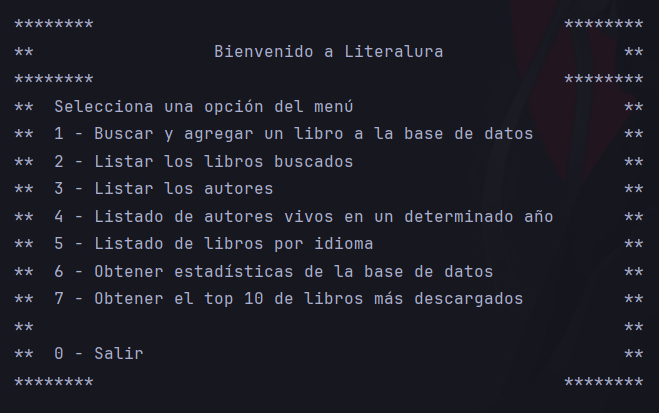

<h1 align="center"> Literalura Challenge ONE 📚 </h1>

   



Proyecto desarrollado como un **catálogo de libros** a través de Java y Spring, que nos permite seleccionar una serie de opciones para interactuar con una API y una base de datos montada en PostgreSQL. La API que se utiliza es **Gutendex**, la cual nos proporciona un extenso conjunto de datos con los cuales podemos interactuar según las opciones que se elijan.

<h2> Descripción del proyecto 📃</h2> 

El programa nos permite seleccionar entre una serie de opciones; estas opciones nos permiten consultar información determinada de los libros, así como los autores de cada uno de ellos. La función principal se basa en la consulta de libros a través de la API para luego almacenarlos en la base de datos de PostgreSQL.

**Las opciones con las que cuenta el programa son las siguientes:**
1. Buscar y agregar un libro a la base de datos
2. Listar los libros buscados
3. Listar los autores
4. Listado de autores vivos en un determinado año
5. Listado de libros por idioma
6. Obtener estadísticas de la base de datos
7. Obtener el top 10 de los libros más descargados

<h2> Tecnologías 📂</h2>

**Lenguaje de desarrollo:**
Java usando jdk 17

**Dependencias:**
Se hace uso de las siguientes dependencias:

*Spring Boot*:
* spring-boot-starter-data-jpa: para integrar Spring Data JPA y gestionar la persistencia de datos.

*Base de datos y JPA*
* spring-boot-starter-data-jpa: para la integración con JPA y realizar operaciones CRUD sobre las entidades Autor y Libro.
* postgresql: el controlador JDBC para PostgreSQL, necesario para conectar la base de datos PostgreSQL con el proyecto.

*Librerías de consumo de API*
* java.net.http.HttpClient: para realizar solicitudes HTTP y consumir la API externa.

*Jackson*
* jackson-databind: para convertir entre objetos Java y JSON, utilizada en las clases ConvierteDatos y Datos.

*Otras dependencias*
* jakarta.persistence-api: para las anotaciones de persistencia (como @Entity y @Id) y la integración con JPA.
* spring-boot-starter: dependencia base para un proyecto de Spring Boot que incluye los elementos fundamentales.

**Arquitectura:**
- Controlador: gestiona las peticiones del usuario y las respuestas del programa.
- Servicio: encapsula la lógica de negocio para trabajar con la base de datos y la API.
- Repositorio: utilizamos Spring Data JPA para manejar persistencia de datos en la base de datos.
- Modelo: se hace la definición de la entidades principales: Autor y Libro, con sus relaciones.

<h2> Cómo ejecutar el programa 💻</h2>

**Requisitos previos:**
1. JDK 11 o superior.
2. Maven o Gradle para la gestión de dependencias.
3. PostgreSQL o MySQL como base de datos.

**Ejecución del proyecto:**
1. Clona el repositorio usando:
```bash
git clone https://github.com/fullbuster-t/
```
2. Configura tu base de datos en el archivo configuration.properties:
```bash
    spring.datasource.url=jdbc:postgresql://localhost:3306/{nombre de tu base de datos}
    spring.datasource.username={usuario}
    spring.datasource.password={contraseña}
    spring.jpa.hibernate.ddl-auto=update
```
3. Si estás usando algún IDE de desarrollo, basta con correr la aplicación.

<h2> Autor 🙋</h2>


Fullbuster - SoftDev 🇲🇽

